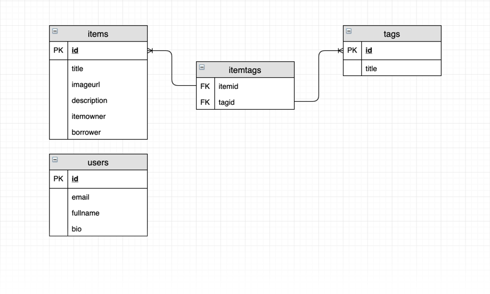

# Boomtown 🏙

A multi-page website for user to share items each other.

[](https://www.apollographql.com/)
[](https://expressjs.com/)
[](https://graphql.org/)
[](https://node-postgres.com/)
[](https://www.postgresql.org/)
&nbsp;

---
&nbsp;
## Physical Data Model



> It represents the actual design blueprint of a relational database and  how data should be structured and related in a specific DBMS.
&nbsp;

---
&nbsp;
## Server

**1. Node.js and Express**
- Start and listen the express server
    ```javascript
    // example app.js
    const express = require('express');
    const app = express();
    const port = 3000;

    app.listen(port, () => console.log(`Example app listening on port ${port}!`));
    ```
- Environment variables

    Server applications often need information about their external environment, such as the url and credentials of an external database, in order to run.

    *Boomtown configuration file: `./server/config/application.js`*


&nbsp;

**2. Node-Postgres**
- node-postgres is a collection of node.js modules for interfacing with your PostgreSQL database.

- Use node-postgres through a connection pool with environment variables.
    ```javascript
    // example postgres.js
    const { Pool } = require("pg");

    module.exports = app => {
        return new Pool({
            user: app.get("PG_USER"),
            host: app.get("PG_HOST"),
            database: app.get("PG_DB"),
            password: app.get("PG_PASSWORD"),
            idleTimeoutMillis: 30000,
            connectionTimeoutMillis: 2000
        });
    };

    ```
    ```javascript
    // example app.js
    const initDB = require('postgres');
    const postgres = initDB(app);

    // the pool will emit an error on behalf of any idle clients
    // it contains if a backend error or network partition happens
    postgres.on('error', (err, client) => {
        console.error('Unexpected error on idle postgres client', err);
        process.exit(-1);
    });

    // example query
    postgres.query('SELECT NOW()', (err, res) => {
        console.log(err, res)
        postgres.end()
    });
    
    ```

&nbsp;

**3. Apollo and GraphQL**
- Apollo Server is a community-maintained open-source GraphQL server that works with all Node.js HTTP server frameworks(Express)
    ```javascript
        // examples app.js
        import express from 'express';
        import bodyParser from 'body-parser';
        import { graphqlExpress } from 'apollo-server-express';

        const myGraphQLSchema = helper.js // name of schema
        const PORT = 3000;

        const app = express();

        app.use('/graphql', bodyParser.json(), graphqlExpress({ schema: myGraphQLSchema }));

        app.listen(PORT);

    ```

- GraphQL

    GraphQL is a query language for your API, and a server-side runtime for executing queries by using a type system you define for your data. GraphQL isn't tied to any specific database or storage engine and is instead backed by your existing code and data.

    - Schema
    
        The most basic components of a GraphQL schema are object types, which just represent a kind of object you can fetch from your service, and what fields it has. In the GraphQL schema language, we might represent it like this:

        ```javascript
        // examples schema.js
        type User {
            id: ID! // non-nullable
            name: String
        }

        // Root Schema :: Query, Mutation
        type Query {
            me: User
            // User is the type defined above
        }
        type Mutation {
            ...
            ...
            ...
        }

        ```
        Default Scalar Types:
        - **Int:** A signed 32‐bit integer.
        - **Float:** A signed double-precision floating-point value.
        - **String:** A UTF‐8 character sequence.
        - **Boolean:** true or false.
        - **ID:** The ID scalar type represents a unique identifier.

&nbsp;

---
&nbsp;
## License
- Structural code is open-sourced under the [MIT license](/LICENSE.md). 
&nbsp;

- Learning materials content is copyright (c) 2019 RED Academy.

<3
        